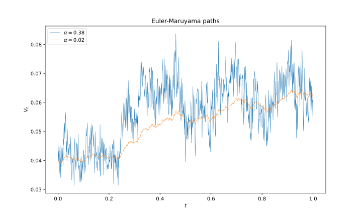
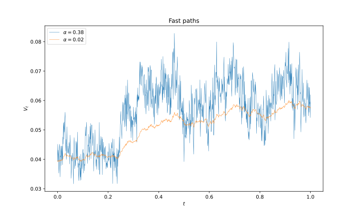
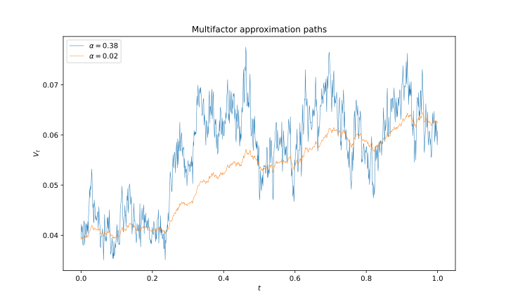
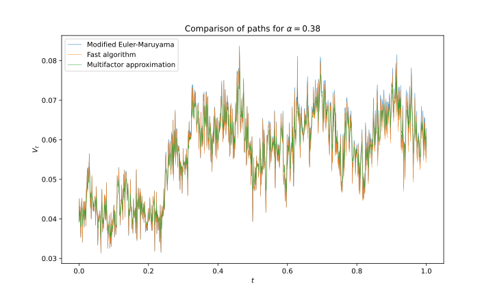
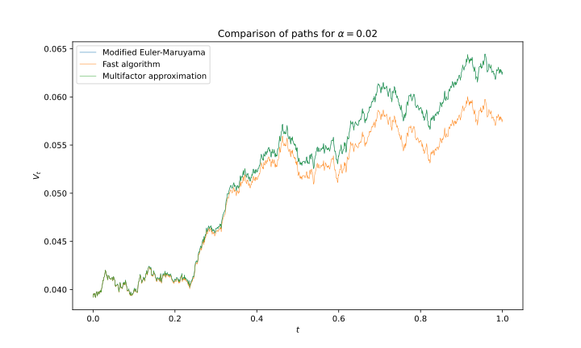

# Final Project

## Introduction

In this project, we want to implement the algorithms proposed by [Ma and Wu (2022)](#Ma2022) to accelerate the simulation of rough volatility processes. In particular, [Ma and Wu (2022)](#Ma2022) focuses on rough Heston model

$$
\begin{equation}
\begin{aligned}
\mathrm{d} S_t &= r S_t \mathrm{d} t+S_t \sqrt{V_t} \mathrm{d} W_t, \\
V_t &= V_0+\frac{1}{\Gamma(1-\alpha)} \int_0^t(t-s)^{-\alpha} f\left(V_s\right) \mathrm{d} s + \frac{1}{\Gamma(1-\alpha)} \int_0^t(t-s)^{-\alpha} g\left(V_s\right) \mathrm{d} B_s, \\
t &\in [0, T], \ \alpha \in(0,1 / 2),
\end{aligned}
\end{equation}
$$

where $f(V_s) = \kappa (\theta - V_s)$, $g(V_s) = \kappa \epsilon \sqrt{V_s}$.

## Modified Euler-Maruyama algorithm for simulating rough Heston models 

<!-- How to reduce the complexity? Avoid storing 

To this end, we start from the approximation of the kernel function by the sum of exponential functions. From the definition of $\Gamma$ function (see Olver et al. 2010), we can write the kernel function $t^{-\alpha}$ for $\alpha>0$ into an integral form
$$
t^{-\alpha}=\frac{1}{\Gamma(\alpha)} \int_0^{\infty} e^{-t s} s^{\alpha-1} \mathrm{~d} s .
$$

This is further written as for $t \in[\tau, T]$ and $\tau=T / N \in(0,1]$,
$$
\begin{aligned}
\Gamma(\alpha) t^{-\alpha}= & \int_0^{\infty} e^{-t s} s^{\alpha-1} \mathrm{~d} s \\
= & \int_0^{2^{-M}} e^{-t s} s^{\alpha-1} \mathrm{~d} s+\int_{2^{-M}}^{2^{N+1}} e^{-t s} s^{\alpha-1} \mathrm{~d} s \\
& +\int_{2^{N+1}}^{\infty} e^{-t s} s^{\alpha-1} \mathrm{~d} s \\
\approx & \int_0^{2^{-M}} e^{-t s} s^{\alpha-1} \mathrm{~d} s+\sum_{j=-M}^{-1} \int_{2^j}^{2^{j+1}} e^{-t s} s^{\alpha-1} \mathrm{~d} s \\
& +\sum_{j=0}^N \int_{2^j}^{2^{j+1}} e^{-t s} s^{\alpha-1} \mathrm{~d} s,
\end{aligned}
$$

--- -->

**Algorithm 1** (Modfied Euler-Maruyama algorithm): 

Let $\{t_n:=n \tau, n=0,1, \ldots, N\}$ be a given uniform mesh on $[0, T]$, where $N$ is a positive integer and $\tau=T / N$. At time level $t_n$, the stochastic Volterra integral equation is approximately written as

$$
\begin{aligned}
V_{t_n}^N= & V_0+\frac{1}{\Gamma(2-\alpha)} \sum_{k=1}^n f\left(V_{t_{k-1}}^N\right) \left[\left(t_n-t_{k-1}\right)^{1-\alpha}-\left(t_n-t_k\right)^{1-\alpha}\right] \\
& +\frac{1}{\Gamma(1-\alpha)} \sum_{k=1}^n g\left(V_{t_{k-1}}^N\right) \left[\frac{\left(t_n-t_{k-1}\right)^{1-2 \alpha}-\left(t_n-t_k\right)^{1-2 \alpha}}{1-2 \alpha}\right]^{1 / 2} Z_{t_k},
\end{aligned}
$$

where $Z_{t_k} \sim \mathcal{N}(0,1)$

## Fast algorithm for simulating rough Heston models 

- It is hard to simulate the paths of the rough Heston model:

    - the volatility process contains an integral process and the kernel $(t − s)^{- \alpha}$ with $\alpha \in (0, 1/2)$ is singular at point $s = t$. 
    
    - The complexity of the Euler-Maruyama algorithm for simulatingone path is proportional to $O(N^2)$ 

    - Since the integrand is singular at $s = t$, the discretization of the integral process needs special treatment to attain good accuracy. 
    
    
- Increase the efficency by approximating the kernel function by the sum of exponential functions. 

From the definition of $\Gamma$ function, we can write the kernel function $t^{-\alpha}$ for $\alpha>0$ into an integral form

$$
t^{-\alpha}=\frac{1}{\Gamma(\alpha)} \int_0^{\infty} e^{-t s} s^{\alpha-1} \mathrm{~d} s .
$$

This is further written as for $t \in[\tau, T]$ and $\tau=T / N \in(0,1]$,

$$
\begin{aligned}
\Gamma(\alpha) t^{-\alpha}= & \int_0^{\infty} e^{-t s} s^{\alpha-1} \mathrm{~d} s \\
= & \int_0^{2^{-M}} e^{-t s} s^{\alpha-1} \mathrm{~d} s+\int_{2^{-M}}^{2^{N+1}} e^{-t s} s^{\alpha-1} \mathrm{~d} s  +\int_{2^{N+1}}^{\infty} e^{-t s} s^{\alpha-1} \mathrm{~d} s \\
\approx & \int_0^{2^{-M}} e^{-t s} s^{\alpha-1} \mathrm{~d} s+\sum_{j=-M}^{-1} \int_{2^j}^{2^{j+1}} e^{-t s} s^{\alpha-1} \mathrm{~d} s +\sum_{j=0}^N \int_{2^j}^{2^{j+1}} e^{-t s} s^{\alpha-1} \mathrm{~d} s,
\end{aligned}
$$

Then, with Gaussian quadrature (Gauss-Jacobi and Gauss-Legendre),

$$
\begin{aligned}
\Gamma(\alpha) t^{-\alpha} \approx & \sum_{k=1}^{n_o} e^{-s_{o, k} t} w_{o, k}+\sum_{j=-M}^{-1} \sum_{k=1}^{n_s} e^{-s_{j, k} t} s_{j, k}^{\alpha-1} w_{j, k} +\sum_{j=0}^N \sum_{k=1}^{n_l} e^{-s_{j, k} t} s_{j, k}^{\alpha-1} w_{j, k}
\end{aligned}
$$

This is re-written into the following compact form:

$$
t^{-\alpha} \approx \sum_{l=1}^{N_{\exp }} \omega_l e^{-x_l t},
$$

where

$$
\begin{aligned}
N_{\exp }= & \left[O \left(\log \frac{1}{\xi}\left(\log \log \frac{1}{\xi}+\log \frac{T}{\tau}\right) +\log \frac{1}{\tau}\left(\log \log \frac{1}{\xi} \log \frac{1}{\tau}\right)\right)\right]
\end{aligned}
$$

and

$$
\begin{aligned}
\{x_l, l=1, \ldots, N_{\exp} \} &=\{s_{o, 1}, \ldots, s_{o, n_o}\} \bigcup  \left(\bigcup_{j=-M}^{-1} \{s_{j, 1}, \ldots, s_{j, n_s}\}\right) \bigcup  \left(\bigcup_{j=0}^N \{s_{j, 1}, \ldots, s_{j, n_l} \}\right), \\
\{\omega_l,l=1, \ldots, N_{\exp}\} &= \{w_{o, 1} / \Gamma(\alpha), \ldots, w_{o, n_o} / \Gamma(\alpha)\} \bigcup\left(\bigcup_{j=-M}^{-1} \{s_{j, 1}^{\alpha-1} w_{j, 1} / \Gamma(\alpha), \ldots, s_{j, n_s}^{\alpha-1} w_{j, n_s} / \Gamma(\alpha) \}\right) \\
& \qquad\bigcup\left(\bigcup_{j=0}^N \{s_{j, 1}^{\alpha-1} w_{j, 1} / \Gamma(\alpha), \ldots, s_{j, n_l}^{\alpha-1} w_{j, n_l} / \Gamma(\alpha)\}\right) .
\end{aligned}
$$

---

**Algorithm 2** (Fast algorithm) The fast algorithm for simulation of (2) is given by

$$
\begin{aligned}
V_{t_n}^N &= V_0+\frac{\tau^{1-\alpha}}{\Gamma(2-\alpha)} f\left(V_{t_{n-1}}^N\right) +\frac{1}{\Gamma(1-\alpha)} \sum_{l=1}^{N_{\text {exp }}} \omega_l e^{-x_l \tau} H_l^N\left(t_{n-1}\right) \\
& +\frac{\tau^{\frac{1}{2}-\alpha}}{\Gamma(1-\alpha)} g\left(V_{t_{n-1}}^N\right) Z_{t_n} +\frac{1}{\Gamma(1-\alpha)} \sum_{l=1}^{N_{\text {exp }}} \omega_l e^{-x_l \tau} J_l^N\left(t_{n-1}\right), \quad n=1, \ldots, N, \\
H_l^N\left(t_{n-1}\right) &= \frac{f\left(V_{t_{n-2}}^N\right)}{x_l}\left(1-e^{-x_l \tau}\right)+e^{-x_l \tau} H_l^N\left(t_{n-2}\right), \quad n=2, \ldots, N, \\
J_l^N\left(t_{n-1}\right) &= e^{-x_l \tau} g\left(V_{t_{n-2}}^N\right) \sqrt{\tau} Z_{t_{n-1}}+e^{-x_l \tau} J_l^N\left(t_{n-2}\right), \quad n=2, \ldots, N,
\end{aligned}
$$

with $V_{t_0}^N=V_0, \quad H_l^N\left(t_0\right)=0, \quad J_l^N\left(t_0\right)=0, \quad \tau=T / N, \quad Z_{t_n} \sim$ $\mathcal{N}(0,1)$ for $n=1, \ldots, N$.

## Multi-factor approximation algorithm for simulating rough Heston models 

[Abi Jaber and El Euch (2019)](#AbiJaber2019) approximate the kernel function by

$$
\frac{t^{-\alpha}}{\Gamma(1-\alpha)} \approx \sum_{j=1}^{\tilde{N}_{\text {exp }}} c_j e^{-\gamma_j t},
$$

with 

$$
\begin{aligned}
& c_j:=\int_{\eta_{j-1}}^{\eta_j} \mu(d \gamma), \quad \gamma_j:=\frac{1}{c_j} \int_{\eta_{j-1}}^{\eta_j} \gamma \mu(d \gamma), \\
& \eta_j:=j \frac{\widetilde{N}_{\exp }^{-1 / 5}}{T}\left(\frac{\sqrt{10} \alpha}{2+\alpha}\right)^{2 / 5}, \quad \mu(d \gamma):=\frac{\gamma^{\alpha-1}}{\Gamma(1-\alpha) \Gamma(\alpha)} \mathrm{d} \gamma.
\end{aligned}
$$

Next, the rough Heston model is approximated by the following multi-factor Heston model

$$
\begin{aligned}
V_t^{\widetilde{N}_{\text {exp}}} & =V_0+\kappa \theta \sum_{j=1}^{\widetilde{N}_{\text {exp}}} \frac{c_j}{\gamma_j}\left(1-e^{-\gamma_j t}\right)+\sum_{j=1}^{\widetilde{N}_{\text {exp}}} c_j V_t^{\widetilde{N}_{\text {exp}}, j}, \\
d V_t^{\widetilde{N}_{\text {exp}}, j} & =\left(-\gamma_j V_t^{\widetilde{N}_{\text {exp}}, j}-\kappa V_t^{\widetilde{N}_{\text {exp}}}\right) \mathrm{d} t+g\left(V_t^{\widetilde{N}_{\text {exp}}}\right) \mathrm{d} B_t,
\end{aligned}
$$

with $V_0^{\widetilde{N}_{\text {exp}}, j} = 0$, for $j=1, \ldots, \tilde{N}_{\text{exp}}$.

---

Algorithm 4 (Multi-factor approximation algorithm, [Abi Jaber (2019)](#AbiJaber2019)) Let $V_{t_n}^{\widetilde{N}_\text{exp}, N}$ and $V_{t_n}^{\tilde{N}_{\text{exp}}, j, N}$ denote the approximation of $V_{t_n}^{\tilde{N}_{\text{exp}}}$ and $V_{t_n}^{\tilde{N}_{\text{exp}}, j}$, respectively, for $n=0,1, \ldots, N$. Then the algorithm for simulation of rough Heston model given by

$$
\begin{aligned}
& V_{t_n}^{\widetilde{N}_{\text{exp}}, N}=V_{t_0}^{\widetilde{N}_{\text{exp}}, N}+\kappa \theta \sum_{j=1}^{\tilde{N}_{\text{exp}}} \frac{c_j}{\gamma_j}\left(1-e^{-\gamma_j t_n}\right)+\sum_{j=1}^{\tilde{N}_{\text{exp}}} c_j V_{t_n}^{\widetilde{N}_{\text{exp}}, j, N}, \\
& V_{t_n}^{\widetilde{N}_{\text{exp}}, j, N}=\frac{V_{t_{n-1}}^{\widetilde{N}_{\text{exp}}, j, N}-\kappa V_{t_{n-1}}^{\widetilde{N}_{\text{exp}}, N} \tau+g\left(V_{t_{n-1}}^{\widetilde{N}_{\text{exp}}, N}\right) \sqrt{\tau} Z_{t_n}}{1+\gamma_j \tau}, \\
& j=1,2, \ldots, \widetilde{N}_{\text{exp}}, \\
\end{aligned}
$$

where $V_{t_0}^{\tilde{N}_{\text{exp}}, N}=V_0, V_{t_0}^{\widetilde{N}_{\text{exp}}, N}=0, \tau=T / N, Z_{t_n} \sim \mathcal{N}(0,1)$ for $n=1, \ldots, N$, and $c_j, \gamma_j, \eta_j$ are given by (27). It thus gives the simulation of the rough Heston model (29) with $V_{t_n} \approx$ $V_{t_n}^{\widetilde{N}_{\text{exp}}, N}$ for $n=0,1, \ldots, N$.

## Results

### Comparison among three algorithms

- For $\alpha=0.38$, the Fast algorithm approximates well the pattern of the Modified Euler-Maruyama algorithm, whereas for $\alpha=0.02$, the Multi-factor approximation algorithm generates very similar paths to the Modified Euler-Maruyama algorithm.

### Option pricing

Use the same parameters from [Callegaro et al. (2021)](#Callegaro2021), 

$$
S_0=100, \quad V_0=0.0392, \quad \rho=-0.681, \quad \kappa=0.1, \theta=0.3156, \quad \epsilon=0.331, \quad r=0 .
$$

Run the simulation with number of time steps $250$, number of paths $100,000$. Repeat the experiment for $100$ times.

- $\alpha=0.38$:

| Strike | 80 | 85 | 90 | 95 | 100 | 105 | 110 | 115 | 120 |
| ------ | -- | -- | -- | -- | --- | --- | --- | --- | --- |
| Modified EM | 22.12203398 | 18.33473566 | 14.94505137 | 11.98009591 | 9.44551607 | 7.32696825 | 5.59420053 | 4.20612893 | 3.11648568 |
| Fast | 22.09846982 | 18.30534597 | 14.91240798 | 11.94583918 | 9.41128291 | 7.29444754 | 5.56505075 | 4.18083187 | 3.09508284 |

- $\alpha=0.02$ : To be done.

## References

[1] Ma, J. and Wu, H. (2022) A fast algorithm for simulation of rough volatility models, Quantitative Finance, 22:3, 447-462, DOI: [10.1080/14697688.2021.1970213](https://doi.org/10.1080/14697688.2021.1970213)

[2] Callegaro, G., Grasselli, M. and Pagès, G. (2021) Fast Hybrid Schemes for Fractional Riccati Equations (Rough Is Not So
Tough). Mathematics of Operations Research 46(1):221-254. DOI: [10.1287/moor.2020.1054](https://doi.org/10.1287/moor.2020.1054)

[3] Abi Jaber, E., & El Euch, O. (2019). Multifactor approximation of rough volatility models. SIAM journal on financial mathematics, 10(2), 309-349, DOI: [10.1137/18M1170236](https://doi.org/10.1137/18M1170236)
