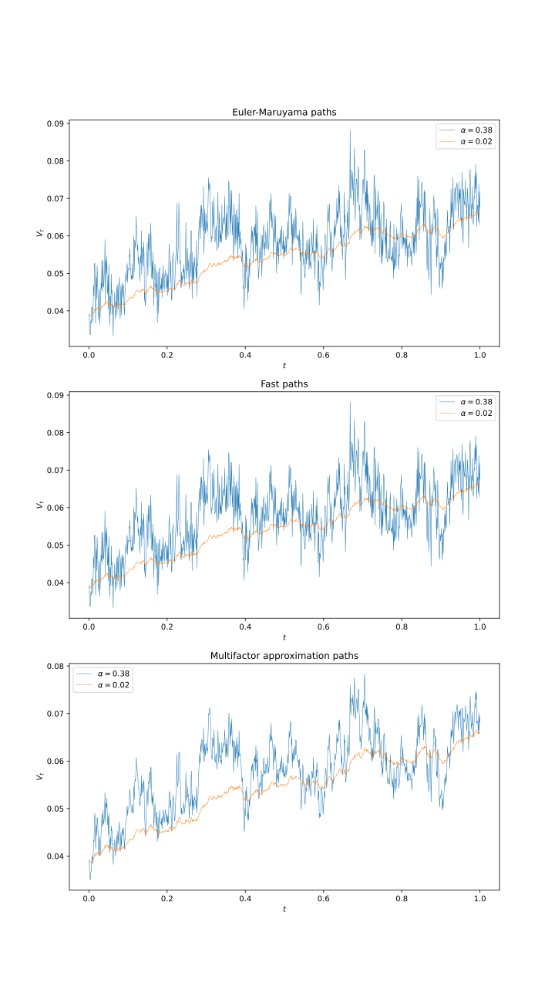
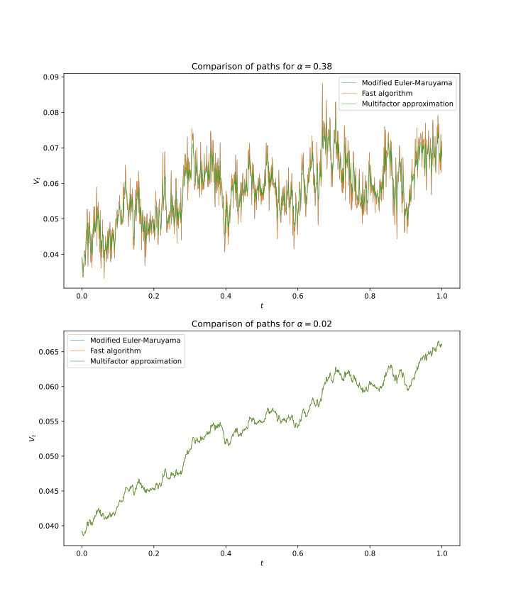

# Final Project

Team members: Enze Zhou, Vahan Geghamyan

## 1. Introduction

In this project, we want to implement the algorithms proposed by [Ma and Wu (2022)](#Ma2022) to accelerate the simulation of rough volatility processes. In particular, [Ma and Wu (2022)](#Ma2022) focuses on the rough Heston model

$$
\begin{equation}
\begin{aligned}
\mathrm{d} S_t &= r S_t \mathrm{d} t+S_t \sqrt{V_t} \mathrm{d} W_t, \\
V_t &= V_0+\frac{1}{\Gamma(1-\alpha)} \int_0^t(t-s)^{-\alpha} f\left(V_s\right) \mathrm{d} s + \frac{1}{\Gamma(1-\alpha)} \int_0^t(t-s)^{-\alpha} g\left(V_s\right) \mathrm{d} B_s, \\
t &\in [0, T], \ \alpha \in(0,1 / 2),
\end{aligned}
\end{equation}
$$

where $f(V_s) = \kappa (\theta - V_s)$, $g(V_s) = \kappa \epsilon \sqrt{V_s}$, and $\kappa, \theta, \epsilon$ are given positive constants.

## 2. Algorithms

### 2.1 Modified Euler-Maruyama algorithm

Let $\{t_n:=n \tau, n=0,1, \ldots, N\}$ be a given uniform mesh on $[0, T]$, where $N$ is a positive integer and $\tau=T / N$. At time level $t_n$, the stochastic Volterra integral equation is written as

$$
\begin{aligned}
V_{t_n}= V_0+\frac{1}{\Gamma(1-\alpha)} \int_0^{t_n}\left(t_n-s\right)^{-\alpha} f\left(V_s\right) \mathrm{d} s + \frac{1}{\Gamma(1-\alpha)} \int_0^{t_n}\left(t_n-s\right)^{-\alpha} g\left(V_s\right) \mathrm{d} B_s .
\end{aligned}
$$

We can then derive that 
$$
\begin{aligned}
V_{t_n} &= V_0+\frac{1}{\Gamma(1-\alpha)} \sum_{k=1}^n \int_{t_{k-1}}^{t_k}\left(t_n-s\right)^{-\alpha} f\left(V_s\right) \mathrm{d} s +\frac{1}{\Gamma(1-\alpha)} \sum_{k=1}^n \int_{t_{k-1}}^{t_k}\left(t_n-s\right)^{-\alpha} g\left(V_s\right) \mathrm{d} B_s \\
&\approx V_0+\frac{1}{\Gamma(1-\alpha)} \sum_{k=1}^n f\left(V_{t_{k-1}}\right) \int_{t_{k-1}}^{t_k}\left(t_n-s\right)^{-\alpha} \mathrm{d} s +\frac{1}{\Gamma(1-\alpha)} \sum_{k=1}^n g\left(V_{t_{k-1}}\right) \int_{t_{k-1}}^{t_k}\left(t_n-s\right)^{-\alpha} \mathrm{d} B_s \\
&= V_0+\frac{1}{\Gamma(2-\alpha)} \sum_{k=1}^n f\left(V_{t_{k-1}}\right) \times\left[\left(t_n-t_{k-1}\right)^{1-\alpha}-\left(t_n-t_k\right)^{1-\alpha}\right] +\frac{1}{\Gamma(1-\alpha)} \sum_{k=1}^n g\left(V_{t_{k-1}}\right) \int_{t_{k-1}}^{t_k}\left(t_n-s\right)^{-\alpha} \mathrm{d} B_s,
\end{aligned}
$$

where 

$$
\begin{aligned}
\int_{t_{k-1}}^{t_k}\left(t_n-s\right)^{-\alpha} \mathrm{d} B_s \sim \mathcal{N}\left(0, \int_{t_{k-1}}^{t_k}\left(t_n-s\right)^{-2 \alpha} \mathrm{d} s\right) =\mathcal{N}\left(0, \frac{\left(t_n-t_{k-1}\right)^{1-2 \alpha}-\left(t_n-t_k\right)^{1-2 \alpha}}{1-2 \alpha}\right)
\end{aligned}
$$

---

**Algorithm 1** (Modfied Euler-Maruyama algorithm): 

Let $\{t_n:=n \tau, n=0,1, \ldots, N\}$ be a given uniform mesh on $[0, T]$, where $N$ is a positive integer and $\tau=T / N$. At time level $t_n$, the stochastic Volterra integral equation is approximately written as

$$
\begin{aligned}
V_{t_n}^N &= V_0+\frac{1}{\Gamma(2-\alpha)} \sum_{k=1}^n f\left(V_{t_{k-1}}^N\right) \left[\left(t_n-t_{k-1}\right)^{1-\alpha}-\left(t_n-t_k\right)^{1-\alpha}\right] \\
&\quad +\frac{1}{\Gamma(1-\alpha)} \sum_{k=1}^n g\left(V_{t_{k-1}}^N\right) \left[\frac{\left(t_n-t_{k-1}\right)^{1-2 \alpha}-\left(t_n-t_k\right)^{1-2 \alpha}}{1-2 \alpha}\right]^{1 / 2} Z_{t_k},
\end{aligned}
$$

where $Z_{t_k} \sim \mathcal{N}(0,1)$

### 2.2 Fast algorithm


- It is hard to simulate the paths of the rough Heston model:

    - the volatility process contains an integral process and the kernel $(t − s)^{- \alpha}$ with $\alpha \in (0, 1/2)$ is singular at point $s = t$. 
    
    - The complexity of the Euler-Maruyama algorithm for simulating one path is $O(N^2)$ 

    - Since the integrand is singular at $s = t$, the discretization of the integral process needs special treatment to attain good accuracy. 
    
    
- Solution: approximating the kernel function by the sum of exponential functions. 


From the definition of $\Gamma$ function ([Olver et al., 2010](#Olver2010)), we can write the kernel function $t^{-\alpha}$ for $\alpha>0$ into an integral form

$$
t^{-\alpha}=\frac{1}{\Gamma(\alpha)} \int_0^{\infty} e^{-t s} s^{\alpha-1} \mathrm{~d} s .
$$

This is further written as for $t \in[\tau, T]$ and $\tau=T / N \in(0,1]$,

$$
\begin{aligned}
\Gamma(\alpha) t^{-\alpha}= & \int_0^{\infty} e^{-t s} s^{\alpha-1} \mathrm{~d} s \\
= & \int_0^{2^{-M}} e^{-t s} s^{\alpha-1} \mathrm{~d} s+\int_{2^{-M}}^{2^{N+1}} e^{-t s} s^{\alpha-1} \mathrm{~d} s  +\int_{2^{N+1}}^{\infty} e^{-t s} s^{\alpha-1} \mathrm{~d} s \\
\approx & \int_0^{2^{-M}} e^{-t s} s^{\alpha-1} \mathrm{~d} s+\sum_{j=-M}^{-1} \int_{2^j}^{2^{j+1}} e^{-t s} s^{\alpha-1} \mathrm{~d} s +\sum_{j=0}^N \int_{2^j}^{2^{j+1}} e^{-t s} s^{\alpha-1} \mathrm{~d} s,
\end{aligned}
$$

where $M=O[\log(T)]$ and $N=\left[O\left(\log\log\frac{1}{\xi}+\log\frac{1}{\tau}\right)\right]$. Then, with Gaussian quadrature (Gauss-Jacobi and Gauss-Legendre),

$$
\begin{aligned}
\Gamma(\alpha) t^{-\alpha} \approx & \sum_{k=1}^{n_o} e^{-s_{o, k} t} w_{o, k}+\sum_{j=-M}^{-1} \sum_{k=1}^{n_s} e^{-s_{j, k} t} s_{j, k}^{\alpha-1} w_{j, k} +\sum_{j=0}^N \sum_{k=1}^{n_l} e^{-s_{j, k} t} s_{j, k}^{\alpha-1} w_{j, k},
\end{aligned}
$$

where $n_o=\left[O\left(\log\frac{1}{\xi}\right)\right], n_s=\left[O\left(\log\frac{1}{\xi}\right)\right], n_l=\left[O\left(\log\frac{1}{\xi}+\log\frac{1}{\tau}\right)\right]$. This is re-written into the following compact form:

$$
t^{-\alpha} \approx \sum_{l=1}^{N_{\exp }} \omega_l e^{-x_l t},
$$

where

$$
\begin{aligned}
N_{\exp }= & \left[O \left(\log \frac{1}{\xi}\left(\log \log \frac{1}{\xi}+\log \frac{T}{\tau}\right) +\log \frac{1}{\tau}\left(\log \log \frac{1}{\xi} \log \frac{1}{\tau}\right)\right)\right]
\end{aligned}
$$

and

$$
\begin{aligned}
\{x_l, l=1, \ldots, N_{\exp} \} &=\{s_{o, 1}, \ldots, s_{o, n_o}\} \bigcup  \left(\bigcup_{j=-M}^{-1} \{s_{j, 1}, \ldots, s_{j, n_s}\}\right) \bigcup  \left(\bigcup_{j=0}^N \{s_{j, 1}, \ldots, s_{j, n_l} \}\right), \\
\{\omega_l,l=1, \ldots, N_{\exp}\} &= \{w_{o, 1} / \Gamma(\alpha), \ldots, w_{o, n_o} / \Gamma(\alpha)\} \bigcup\left(\bigcup_{j=-M}^{-1} \{s_{j, 1}^{\alpha-1} w_{j, 1} / \Gamma(\alpha), \ldots, s_{j, n_s}^{\alpha-1} w_{j, n_s} / \Gamma(\alpha) \}\right) \\
& \qquad\bigcup\left(\bigcup_{j=0}^N \{s_{j, 1}^{\alpha-1} w_{j, 1} / \Gamma(\alpha), \ldots, s_{j, n_l}^{\alpha-1} w_{j, n_l} / \Gamma(\alpha)\}\right) .
\end{aligned}
$$

Then, the approximation error of $t^{-\alpha}$ is given by [Jiang et al. (2017)](#Jiang2017):

$$
\left|t^{-\alpha}-\sum_{l=1}^{N_{\exp }} \omega_l e^{-x_l t}\right| \leq \xi, \quad \text { for } t \in[\tau, T].
$$

Next we derive the fast algorithm to solve the stochastic Volterra integral equation. Denote

$$
\begin{aligned}
I_1^n & :=\int_0^{t_n}\left(t_n-s\right)^{-\alpha} f\left(V_s\right) \mathrm{d} s, \\
I_2^n & :=\int_0^{t_n}\left(t_n-s\right)^{-\alpha} g\left(V_s\right) \mathrm{d} B_s .
\end{aligned}
$$

Then we use the approximation of the kernel, we obtain that

$$
\begin{aligned}
I_1^n &= \int_{t_{n-1}}^{t_n}\left(t_n-s\right)^{-\alpha} f\left(V_s\right) \mathrm{d} s+\int_0^{t_{n-1}}\left(t_n-s\right)^{-\alpha} f\left(V_s\right) \mathrm{d} s \\
&\approx \int_{t_{n-1}}^{t_n}\left(t_n-s\right)^{-\alpha} f\left(V_s\right) \mathrm{d} s+\int_0^{t_{n-1}} \sum_{l=1}^{N_{\text {exp }}} \omega_l e^{-x_l\left(t_n-s\right)} f\left(V_s\right) \mathrm{d} s \\
&= \int_{t_{n-1}}^{t_n}\left(t_n-s\right)^{-\alpha} f\left(V_s\right) \mathrm{d} s +\sum_{l=1}^{N_{\text {exp }}} \omega_l e^{-x_l \tau} \int_0^{t_{n-1}} e^{-x_l\left(t_{n-1}-s\right)} f\left(V_s\right) \mathrm{d} s \\
&\approx \frac{\tau^{1-\alpha}}{1-\alpha} f\left(V_{t_{n-1}}\right)+\sum_{l=1}^{N_{\text {exp }}} \omega_l e^{-x_l \tau} H_l\left(t_{n-1}\right),
\end{aligned}
$$

where $\tau=t_n-t_{n-1}=T/N$, and 

$$
\begin{aligned}
H_l\left(t_{n-1}\right) &:= \int_0^{t_{n-1}} e^{-x_l\left(t_{n-1}-s\right)} f\left(V_s\right) \mathrm{d} s \\
&= \int_{t_{n-2}}^{t_{n-1}} e^{-x_l\left(t_{n-1}-s\right)} f\left(V_s\right) \mathrm{d} s +e^{-x_l \tau} \int_0^{t_{n-2}} e^{-x_l\left(t_{n-2}-s\right)} f\left(V_s\right) \mathrm{d} s \\
&= \int_{t_{n-2}}^{t_{n-1}} e^{-x_l\left(t_{n-1}-s\right)} f\left(V_s\right) \mathrm{d} s+e^{-x_l \tau} H_l\left(t_{n-2}\right) \\
&\approx \frac{1-e^{-x_l \tau}}{x_l} f\left(V_{t_{n-2}}\right)+e^{-x_l \tau} H_l\left(t_{n-2}\right),
\end{aligned}
$$

with $H_l(t_0)=0$ for $1 \leq l \leq N_{\text{exp}}$. The decomposition of $I_2^n$ is similar:

$$
\begin{aligned}
I_2^n & =\int_{t_{n-1}}^{t_n}\left(t_n-s\right)^{-\alpha} g\left(V_s\right) \mathrm{d} B_s+\sum_{l=1}^{N_{\text {exp }}} \omega_l e^{-x_l \tau} J_l\left(t_{n-1}\right) \\
& \approx \tau^{-\alpha} g\left(V_{t_{n-1}}\right)\left(B_{t_n}-B_{t_{n-1}}\right)+\sum_{l=1}^{N_{\text {exp }}} \omega_l e^{-x_l \tau} J_l\left(t_{n-1}\right), \\
& = \frac{\tau^{\frac{1}{2}-\alpha}}{(1-2 \alpha)^{\frac{1}{2}}} g\left(V_{t_{n-1}}\right) Z_{t_n}+\sum_{l=1}^{N_{\text {exp }}} \omega_l e^{-x_l \tau} J_l\left(t_{n-1}\right), \\
J_l\left(t_{n-1}\right) &:=  \int_0^{t_{n-1}} e^{-x_l\left(t_{n-1}-s\right)} g\left(V_s\right) \mathrm{d} s \\
&= \int_{t_{n-2}}^{t_{n-1}} e^{-x_l\left(t_{n-1}-s\right)} g\left(V_s\right) \mathrm{d} B_s +e^{-x_l \tau} \int_0^{t_{n-2}} e^{-x_l\left(t_{n-2}-s\right)} g\left(V_s\right) \mathrm{d} B_s \\
&= \int_{t_{n-2}}^{t_{n-1}} e^{-x_l\left(t_{n-1}-s\right)} g\left(V_s\right) \mathrm{d} B_s+e^{-x_l \tau} J_l\left(t_{n-2}\right) \\
&\approx \sqrt{\frac{1-e^{-2x_l \tau}}{2 x_l}} g\left(V_{t_{n-2}}\right) Z_{t_{n-1}}+e^{-x_l \tau} J_l\left(t_{n-2}\right).
\end{aligned}
$$
Combining all, we have the Fast algorithm.

---

**Algorithm 2** (Fast algorithm) The fast algorithm for simulation of (2) is given by

$$
\begin{aligned}
V_{t_n}^N &= V_0+\frac{\tau^{1-\alpha}}{\Gamma(2-\alpha)} f\left(V_{t_{n-1}}^N\right) +\frac{1}{\Gamma(1-\alpha)} \sum_{l=1}^{N_{\text {exp }}} \omega_l e^{-x_l \tau} H_l^N\left(t_{n-1}\right) \\
& \quad +\frac{\tau^{\frac{1}{2}-\alpha}}{\sqrt{1-2\alpha}\  \Gamma(1-\alpha)} g\left(V_{t_{n-1}}^N\right) Z_{t_n} +\frac{1}{\Gamma(1-\alpha)} \sum_{l=1}^{N_{\text {exp }}} \omega_l e^{-x_l \tau} J_l^N\left(t_{n-1}\right), \quad n=1, \ldots, N, \\
H_l^N\left(t_{n-1}\right) &= \frac{f\left(V_{t_{n-2}}^N\right)}{x_l}\left(1-e^{-x_l \tau}\right)+e^{-x_l \tau} H_l^N\left(t_{n-2}\right), \quad n=2, \ldots, N, \\
J_l^N\left(t_{n-1}\right) &= \sqrt{\frac{1-e^{-2 x_l \tau}}{2 x_l}}  g\left(V_{t_{n-2}}^N\right) Z_{t_{n-1}}+e^{-x_l \tau} J_l^N\left(t_{n-2}\right), \quad n=2, \ldots, N,
\end{aligned}
$$

with $V_{t_0}^N=V_0, H_l^N\left(t_0\right)=0, J_l^N\left(t_0\right)=0, \tau=T / N, Z_{t_n} \sim$ $\mathcal{N}(0,1)$ for $n=1, \ldots, N$.


### 2.3 Multi-factor approximation algorithm

[Abi Jaber and El Euch (2019)](#AbiJaber2019) approximate the kernel function by

$$
\frac{t^{-\alpha}}{\Gamma(1-\alpha)} \approx \sum_{j=1}^{\widetilde{N}_{\text {exp }}} c_j e^{-\gamma_j t},
$$

with 

$$
\begin{aligned}
& c_j:=\int_{\eta_{j-1}}^{\eta_j} \mu(d \gamma), \quad \gamma_j:=\frac{1}{c_j} \int_{\eta_{j-1}}^{\eta_j} \gamma \mu(d \gamma), \\
& \eta_j:=j \frac{\widetilde{N}_{\exp }^{-1 / 5}}{T}\left(\frac{\sqrt{10} \alpha}{2+\alpha}\right)^{2 / 5}, \quad \mu(d \gamma):=\frac{\gamma^{\alpha-1}}{\Gamma(1-\alpha) \Gamma(\alpha)} \mathrm{d} \gamma.
\end{aligned}
$$

Next, the rough Heston model is approximated by the following multi-factor Heston model

$$
\begin{aligned}
V_t^{\widetilde{N}_{\text {exp}}} & =V_0+\kappa \theta \sum_{j=1}^{\widetilde{N}_{\text {exp}}} \frac{c_j}{\gamma_j}\left(1-e^{-\gamma_j t}\right)+\sum_{j=1}^{\widetilde{N}_{\text {exp}}} c_j V_t^{\widetilde{N}_{\text {exp}}, j}, \\
d V_t^{\widetilde{N}_{\text {exp}}, j} & =\left(-\gamma_j V_t^{\widetilde{N}_{\text {exp}}, j}-\kappa V_t^{\widetilde{N}_{\text {exp}}}\right) \mathrm{d} t+g\left(V_t^{\widetilde{N}_{\text {exp}}}\right) \mathrm{d} B_t,
\end{aligned}
$$

with $V_0^{\widetilde{N}_{\text {exp}}, j} = 0$, for $j=1, \ldots, \tilde{N}_{\text{exp}}$.

---

Algorithm 4 (Multi-factor approximation algorithm, [Abi Jaber et al. (2019)](#AbiJaber2019)) Let $V_{t_n}^{\widetilde{N}_\text{exp}, N}$ and $V_{t_n}^{\tilde{N}_{\text{exp}}, j, N}$ denote the approximation of $V_{t_n}^{\tilde{N}_{\text{exp}}}$ and $V_{t_n}^{\tilde{N}_{\text{exp}}, j}$, respectively, for $n=0,1, \ldots, N$. Then the algorithm for simulation of rough Heston model given by

$$
\begin{aligned}
& V_{t_n}^{\widetilde{N}_{\text{exp}}, N}=V_{t_0}^{\widetilde{N}_{\text{exp}}, N}+\kappa \theta \sum_{j=1}^{\tilde{N}_{\text{exp}}} \frac{c_j}{\gamma_j}\left(1-e^{-\gamma_j t_n}\right)+\sum_{j=1}^{\tilde{N}_{\text{exp}}} c_j V_{t_n}^{\widetilde{N}_{\text{exp}}, j, N}, \\
& V_{t_n}^{\widetilde{N}_{\text{exp}}, j, N}=\frac{V_{t_{n-1}}^{\widetilde{N}_{\text{exp}}, j, N}-\kappa V_{t_{n-1}}^{\widetilde{N}_{\text{exp}}, N} \tau+g\left(V_{t_{n-1}}^{\widetilde{N}_{\text{exp}}, N}\right) \sqrt{\tau} Z_{t_n}}{1+\gamma_j \tau}, \\
& j=1,2, \ldots, \widetilde{N}_{\text{exp}}, \\
\end{aligned}
$$

where $V_{t_0}^{\tilde{N}_{\text{exp}}, N}=V_0, V_{t_0}^{\widetilde{N}_{\text{exp}}, N}=0, \tau=T / N, Z_{t_n} \sim \mathcal{N}(0,1)$ for $n=1, \ldots, N$, and $c_j, \gamma_j, \eta_j$ are given by (27). It thus gives the simulation of the rough Heston model (29) with $V_{t_n} \approx$ $V_{t_n}^{\widetilde{N}_{\text{exp}}, N}$ for $n=0,1, \ldots, N$.

## 3. Usage with PyFENG

`In [1]:`
```Python
import numpy as np
import pyfeng as pf
import matplotlib.pyplot as plt
import pandas as pd
```

`In [2]:`
```Python
rheston_038 = pf.RoughHestonMcMaWu2022(V_0=0.0392, rho=-0.681, kappa=0.1, epsilon=0.331, theta=0.3156, alpha=0.38) # initialize the model
rheston_038.set_num_params(texp=1, n_path=1_000, n_ts=1_000) # set the time to maturity, number of paths, and number of time steps
Z_t, W_t = rheston_038.random_normals() # generate the random normals for simulation
V_t = rheston_038.Fast(Z_t) # simulate the volatility process (in this case the Fast algorithm is used)
K = np.linspace(80, 120, 9) # strikes
rheston_038.price(spot=100, V_t=V_t, W_t=W_t, strike=K)[1] # price European options
```

`Out [2]:`
```Python
array([22.43265973, 18.67012492, 15.35417673, 12.46352008, 9.92584184, 7.75283787, 5.96323521, 4.50957968, 3.38396187])
```

## 4. Experiments

### 4.1 Comparison among three algorithms



Observations:
- the paths generated by the Modified Euler-Maruyama algorithm and the Fast algorithm exhibit the same extent of roughness when $\alpha=0.38$, while the paths from the Multifactor approximation algorithm seems smoother.
- the paths of $\alpha=0.38$ is much rougher than that of $\alpha=0.02$, obviously and intuitively



Observations:
- when $\alpha=0.38$, the Fast algorithm generates very similar paths to that of the Modified Euler-Maruyama algorithm
- While when $\alpha=0.02$, the Multi-factor approximation algorithm instead generates very similar paths to that of the Modified Euler-Maruyama algorithm.
- the gap between the Fast algorithm and the Modified Euler-Maruyama algorithm widens as time evolves

### 4.2 Computation time

For $T=1$,

|      |        One path             | One path | 1000 paths simultaneously | 1000 paths simultaneously |
| ---- | -------------- | ---------- | -------------- | --------- |
| # time step | Euler-Maruyama | Fast       | Euler-Maruyama | Fast      |
| 250  | 6.615250       | 8.578748   | 0.115804       | 0.185450  |
| 500  | 14.519335      | 17.271443  | 0.592969       | 0.415592  |
| 1000 | 38.725009      | 34.958345  | 2.544576       | 1.085544  |
| 2000 | 113.862958     | 69.938801  | 8.690365       | 2.323525  |
| 4000 | 368.988235     | 141.535237 | 41.461980      | 5.271604  |
| 6000 | 1391.173844    | 290.813273 | 169.880603     | 15.053457 |

The above computation time is measured in milliseconds (ms). We can see that
- when time step is large, the Fast algorithm takes less time; when time step is small, the Modified Euler-Maruyama algorithm takes less time
- due to vectorization, the average time for generating one path in the latter case, generating 1000 paths simultaneously, is significantly shorter (up to **45x faster**)

### 4.3 Option pricing

Use the same parameters from [Callegaro et al. (2021)](#Callegaro2021), 

$$
S_0=100, \quad V_0=0.0392, \quad \rho=-0.681, \quad \kappa=0.1, \quad \theta=0.3156, \quad \epsilon=0.331, \quad r=0 .
$$

Run the simulation with number of time steps $250$, number of paths $100,000$. Repeat the experiment for $100$ times (note that every time you run you might get different results due to the very nature of MC simulation).

- $\alpha=0.38$:

    | Strike | Algo type | One day | One week | One month | Six months | One year | Two years |
    | --- | --- | --- | --- | --- | --- | --- | --- |
    | 80 | [Callegaro et al. (2021)](#Callegaro2021) | 20 | 20 | 20.0005 | 20.6112 | 22.1366 | 25.4301 |
    |  | Modified EM | 19.99995     | 19.999989 | 20.000658 | 20.607918  | 22.120343 | 25.396956 |
    |  | Fast | 19.99999     | 19.999658 | 20.002350 | 20.602332  | 22.116782 | 25.395223 |
    | 85 | [Callegaro et al. (2021)](#Callegaro2021) | 15 | 15 | 15.0108 | 16.2807 | 18.3529 | 22.2091 |
    |  | Modified EM | 14.99995     | 14.999989 | 15.010846 | 16.274347  | 18.332555 | 22.171247 |
    |  | Fast | 14.99999     | 14.999658 | 15.012470 | 16.269161  | 18.328932 | 22.170455 |
    | 90 | [Callegaro et al. (2021)](#Callegaro2021) | 10 | 10.0002 | 10.1144 | 12.3948 | 14.9672 | 19.2898 |
    |  | Modified EM | 9.999954     | 10.000185 | 10.113493 | 12.384250  | 14.942785 | 19.247781 |
    |  | Fast | 9.999991     | 9.999841  | 10.114984 | 12.380106  | 14.940064 | 19.247814 |
    | 95 | [Callegaro et al. (2021)](#Callegaro2021) | 5.0003 | 5.0491 | 5.6723 | 9.0636 | 12.0059 | 16.6676 |
    |  | Modified EM | 4.999954     | 5.044462  | 5.669319  | 9.049536   | 11.977843 | 16.621762 |
    |  | Fast | 4.999991     | 5.044286  | 5.670852  | 9.046654   | 11.976206 | 16.623111 |
    | 100 | [Callegaro et al. (2021)](#Callegaro2021) | 0.5012 | 1.1347 | 2.3896 | 6.3497 | 9.4737 | 14.3319 |
    |  | Modified EM | 0.4147314    | 1.112365  | 2.384964  | 6.334239   | 9.443891  | 14.283308 |
    |  | Fast | 0.4150257    | 1.112836  | 2.385154  | 6.332006   | 9.442838  | 14.285873 |
    | 105 | [Callegaro et al. (2021)](#Callegaro2021) | 6.39e-05 | 0.04113 | 0.6809 | 4.2550 | 7.3563 | 12.2676 |
    |  | Modified EM | 1.266341e-09 | 0.036536  | 0.677000  | 4.239743   | 7.326027  | 12.217084 |
    |  | Fast | 1.872763e-09 | 0.036802  | 0.677158  | 4.238315   | 7.325250  | 12.220843 |
    | 110 | [Callegaro et al. (2021)](#Callegaro2021) | 2.37e-05 | 9.22e-05 | 0.1205 | 2.7251 | 5.6234 | 10.4562 |
    |  | Modified EM | 0.000000     | 6.3e-05   | 0.119173  | 2.711442   | 5.594169  | 10.404734 |
    |  | Fast | 0.000000 | 6.4e-05   | 0.118996  | 2.710650   | 5.592973  | 10.409524 |
    | 115 | [Callegaro et al. (2021)](#Callegaro2021) | 1.51e-05 | 6.82e-09 | 0.0124 | 1.6680 | 4.2343 | 8.8773 |
    |  | Modified EM | 0.000000     | 0.000000  | 0.012148  | 1.656444   | 4.206951  | 8.825911  |
    |  | Fast | 0.000000 | 0.000000 | 0.012111  | 1.655836   | 4.205541  | 8.831125  |
    | 120 | [Callegaro et al. (2021)](#Callegaro2021) | 1.14e-05 | 1.80e-13 | 7.32e-04 | 0.9761 | 3.1424 | 7.5093 |
    |  | Modified EM | 0.000000 | 0.000000 | 6.88e-04 | 0.967280 | 3.117224 | 7.458775 |
    |  | Fast | 0.000000 | 0.000000 | 6.80e-04 | 0.966998 | 3.115929 | 7.464375 |

- $\alpha=0.0001$ (approximation of regular Heston): 

    | Strike | Algo type | One day | One week | One month | Six months | One year | Two years |
    | --- | --- | --- | --- | --- | --- | --- | --- |
    | 80 | Heston FFT | 19.999817    | 20.00000     | 20.000119 | 20.467789  | 21.882194 | 25.342685 |
    |  | Modified EM | 20.00000     | 20.00032     | 19.998105 | 20.462389  | 21.860666 | 25.300803 |
    |  | Fast | 19.99952     | 19.999954    | 20.000860 | 20.461727  | 21.860129 | 25.292780 |
    | 85 | Heston FFT | 14.999592    | 15.00000     | 15.005036 | 16.065825  | 18.044783 | 22.116098 |
    |  | Modified EM | 15.00000     | 15.00032     | 15.002900 | 16.057406  | 18.019379 | 22.070199 |
    |  | Fast | 14.99952     | 14.999954    | 15.005680 | 16.056862  | 18.019123 | 22.063783 |
    | 90 | Heston FFT | 9.999253     | 10.00005     | 10.081315 | 12.117169  | 14.618737 | 19.193730 |
    |  | Modified EM | 9.999998     | 10.00037     | 10.078289 | 12.105610  | 14.590280 | 19.144437 |
    |  | Fast | 9.999518     | 10.000004    | 10.081064 | 12.105038  | 14.589712 | 19.140126 |
    | 95 | Heston FFT | 5.000421     | 5.033864     | 5.594002  | 8.749388   | 11.634501 | 16.570951 |
    |  | Modified EM | 4.999998     | 5.033804     | 5.589046  | 8.735251   | 11.604186 | 16.519429 |
    |  | Fast | 4.999518     | 5.033394     | 5.591302  | 8.734846   | 11.603791 | 16.516900 |
    | 100 | Heston FFT | 0.416402     | 1.097419     | 2.312255  | 6.033819   | 9.098308  | 14.236957 |
    |  | Modified EM | 0.4127088    | 1.095381     | 2.306016  | 6.018755   | 9.067458  | 14.184353 |
    |  | Fast | 0.4125453    | 1.094800     | 2.308085  | 6.018111   | 9.066277  | 14.183246 |
    | 105 | Heston FFT | -0.000445    | 4.138453e-02 | 0.651703  | 3.969527   | 6.994116  | 12.176208 |
    |  | Modified EM | 4.170842e-07 | 4.093408e-02 | 0.647528  | 3.955276   | 6.964014  | 12.123773 |
    |  | Fast | 6.275091e-08 | 4.0794e-02   | 0.648667  | 3.954494   | 6.962025  | 12.123491 |
    | 110 | Heston FFT | 0.000120     | 1.583470e-04 | 0.119056  | 2.490984   | 5.288288  | 10.369848 |
    |  | Modified EM | 0.000000     | 1.592360e-04 | 0.117548  | 2.478975   | 5.260181  | 10.318662 |
    |  | Fast | 0.000000     | 1.53e-04     | 0.117982  | 2.477623   | 5.257120  | 10.318726 |
    | 115 | Heston FFT | -0.000369    | 5.558204e-08 | 0.013874  | 1.492120   | 3.935542  | 8.796976  |
    |  | Modified EM | 0.000000     | 7.617007e-08 | 0.013623  | 1.482647   | 3.910486  | 8.747960  |
    |  | Fast | 0.000000     | 3.838055e-08 | 0.013697  | 1.480754   | 3.906972  | 8.748086  |
    | 120 | Heston FFT | 0.000544 | 4.916068e-10 | 0.001038 | 0.854310 | 2.884879 | 7.435743 |
    |  | Modified EM | 0.000000 | 0.000000 | 0.000991 | 0.847441 | 2.863103 | 7.389376 |
    |  | Fast | 0.000000 | 0.000000 | 0.001027 | 0.845336 | 2.859503 | 7.389534 |

Observations:
- both methods exhibit downward biases compared to [Callegaro et al. (2021)](#Callegaro2021) in both cases
- both methods are quite accurate when the time to maturity is **less than one year**
- both methods approximate well the regular Heston case when the roughness parameter is set to be $\alpha=0.0001$

### 4.4 Conditional MC pricing

1. **Stochastic Differential Equation:**
   $$
   dS_t = r S_t dt + S_t \sqrt{V_t} dW_t = r S_t dt + S_t \sqrt{V_t} (\rho dZ_t + \sqrt{1 - \rho^2} dX_t)
   $$

2. **Logarithmic Transformation of the Stochastic Process:**
   $$
   d \log S_t = \left(r - \frac{1}{2} V_t\right) dt + \rho \sqrt{V_t} dZ_t + \sqrt{1 - \rho^2} \sqrt{V_t} dX_t
   $$

3. **Integrated Form:**
   $$
   \log \frac{S_T}{S_0} = \int_0^T \left(r - \frac{1}{2} V_t\right) dt + \rho \int_0^T \sqrt{V_t} dZ_t + \sqrt{1 - \rho^2} \int_0^T  \sqrt{V_t} dX_t
   $$
   where $Z_t \sim N(0,1)$ and $X_t \sim N(0,1)$.

4. **Definitions:**
   $$
   V_{0,T} = \int_0^T V_t dt, \quad Y_{0,T} = \int_0^T \sqrt{V_t} dZ_t
   $$

5. **Distribution of the Log Price Ratio:**
   $$
   \log \frac{S_T}{S_0} \sim N(\mu, \sigma^2), \quad \text{where } \mu = rT - \frac{1}{2} V_{0,T} + \rho Y_{0,T}, \quad \sigma^2 = (1 - \rho^2) V_{0,T}
   $$

6. **Expression for Expected Values:**
   $$
   F_T = E[S_T | V_{0,T}, Y_{0,T}] = S_0 \exp(rT - \frac{\rho^2}{2} V_{0,T} + \rho Y_{0,T})
   $$

7. **Martingale-Corrected Control Variate ([Choi, 2024](#Choi2024)):**
   $$
   F_T = e^{rT} \frac{S_T}{S_0} \quad \text{(observable)}
   $$
   $$
   F_T^{\text{adj}} = \mu F_T, \quad \text{where } \mu = \frac{S_0 e^{rT}}{{E_{MC}} \{S_T\}}
   $$

8. **Conditional Monte Carlo Method:**
   $$
   S_0^{\text{cond}} = S_0 \exp \left(rT - \frac{\rho^2}{2} V_{0,T} + \rho Y_{0,T}\right), \quad \sigma_{\text{BS}} = \sqrt{(1-\rho^2) \frac{V_{0,T}}{T}}
   $$

- $\alpha=0.38$

   | Strike | Algorithm type                            | One day           | One week         | One month     | Six months    | One year      | Two years     |
   | ------ | ----------------------------------------- | ----------------- | ---------------- | ------------- | ------------- | ------------- | ------------- |
   | 80     | [Callegaro et al. (2021)](#Callegaro2021) | 20                | 20               | 20.0005       | 20.6112       | 22.1366       | 25.4301       |
   |        | Modified EM with CV                       | 20.00000          | 20.00000         | 20.000530     | 20.609109     | 22.129968     | 25.422332     |
   |        | Modified EM w/o CV                        | 19.99983          | 20.00021         | 19.999787     | 20.606124     | 22.129474     | 25.477061     |
   |        | **Fast with CV**                          | **20.00000**      | **20.00000**     | **20.000538** | **20.611888** | **22.137081** | **25.435017** |
   |        | Fast w/o CV                               | 20.00067          | 20.00472         | 20.008197     | 20.585916     | 22.133908     | 25.474415     |
   | 85     | [Callegaro et al. (2021)](#Callegaro2021) | 15                | 15               | 15.0108       | 16.2807       | 18.3529       | 22.2091       |
   |        | Modified EM with CV                       | 15.00000          | 15.00000         | 15.010835     | 16.276725     | 18.343795     | 22.199614     |
   |        | Modified EM w/o CV                        | 14.99983          | 15.00021         | 15.010181     | 16.276702     | 18.344420     | 22.252617     |
   |        | **Fast with CV**                          | **15.00000**      | **15.00000**     | **15.010865** | **16.280416** | **18.353397** | **22.213900** |
   |        | Fast w/o CV                               | 15.00067          | 15.00472         | 15.018561     | 16.256534     | 18.348606     | 22.249163     |
   | 90     | [Callegaro et al. (2021)](#Callegaro2021) | 10                | 10.0002          | 10.1144       | 12.3948       | 14.9672       | 19.2898       |
   |        | Modified EM with CV                       | 10.00000          | 10.00019         | 10.114211     | 12.388313     | 14.955774     | 19.278633     |
   |        | Modified EM w/o CV                        | 9.999833          | 1.000040         | 10.114112     | 12.391560     | 14.957537     | 19.329577     |
   |        | **Fast with CV**                          | **10.00000**      | **10.00019**     | **10.114671** | **12.393068** | **14.967755** | **19.294171** |
   |        | Fast w/o CV                               | 10.00067          | 10.00492         | 10.122112     | 12.372094     | 14.961186     | 19.325278     |
   | 95     | [Callegaro et al. (2021)](#Callegaro2021) | 5.0003            | 5.0491           | 5.6723        | 9.0636        | 12.0059       | 16.6676       |
   |        | Modified EM with CV                       | 5.000001          | 5.044647         | 5.671089      | 9.054696      | 11.992320     | 16.654927     |
   |        | Modified EM w/o CV                        | 4.999834          | 5.045212         | 5.672491      | 9.060704      | 11.995165     | 16.703512     |
   |        | **Fast with CV**                          | **5.000001**      | **5.044777**     | **5.673019**  | **9.060427**  | **12.006290** | **16.671345** |
   |        | Fast w/o CV                               | 5.000667          | 5.049759         | 5.679269      | 9.042810      | 11.998023     | 16.698425     |
   | 100    | [Callegaro et al. (2021)](#Callegaro2021) | 0.5012            | 1.1347           | 2.3896        | 6.3497        | 9.4737        | 14.3319       |
   |        | Modified EM with CV                       | 0.4149906         | 1.112954         | 2.386992      | 6.339111      | 9.458633      | 14.317996     |
   |        | Modified EM w/o CV                        | 0.4158441         | 1.114555         | 2.389364      | 6.346683      | 9.462410      | 14.363978     |
   |        | **Fast with CV**                          | **0.4155871**     | **1.115461**     | **2.389992**  | **6.345394**  | **9.473991**  | **14.334933** |
   |        | Fast w/o CV                               | 0.4164436         | 1.117977         | 2.394024      | 6.331204      | 9.464327      | 14.358234     |
   | 105    | [Callegaro et al. (2021)](#Callegaro2021) | 6.39e-05          | 0.04113          | 0.6809        | 4.2550        | 7.3563        | 12.2676       |
   |        | Modified EM with CV                       | 2.436080e-08      | 0.03675033       | 0.678549      | 4.243822      | 7.340336      | 12.252691     |
   |        | Modified EM w/o CV                        | 2.482031e-08      | 0.03703575       | 0.680147      | 4.251537      | 7.344810      | 12.295893     |
   |        | **Fast with CV**                          | **2.289915e-08**  | **0.03722695**   | **0.680539**  | **4.250018**  | **7.356372**  | **12.269816** |
   |        | Fast w/o CV                               | 2.530729e-08      | 0.03742150       | 0.682432      | 4.239042      | 7.345771      | 12.289666     |
   | 110    | [Callegaro et al. (2021)](#Callegaro2021) | 2.37e-05          | 9.22e-05         | 0.1205        | 2.7251        | 5.6234        | 10.4562       |
   |        | Modified EM with CV                       | 3.516076e-29      | 6.528633e-05     | 0.119568      | 2.714625      | 5.607318      | 10.440569     |
   |        | Modified EM w/o CV                        | 3.331314e-29      | 6.700341e-05     | 0.120089      | 2.721348      | 5.612209      | 10.480884     |
   |        | **Fast with CV**                          | **1.297250e-29**  | **6.722972e-05** | **0.120137**  | **2.720129**  | **5.623322**  | **10.457595** |
   |        | Fast w/o CV                               | 1.362368e-29      | 6.993088e-05     | 0.120779      | 2.711987      | 5.612315      | 10.474375     |
   | 115    | [Callegaro et al. (2021)](#Callegaro2021) | 1.51e-05          | 6.82e-09         | 0.0124        | 1.6680        | 4.2343        | 8.8773        |
   |        | Modified EM with CV                       | 6.613290e-67      | 2.960521e-09     | 0.012311      | 1.658989      | 4.218688      | 8.861141      |
   |        | Modified EM w/o CV                        | 2.278257e-66      | 3.378017e-09     | 0.012397      | 1.664140      | 4.223710      | 8.898525      |
   |        | **Fast with CV**                          | **2.918629e-67**  | **3.366561e-09** | **0.012378**  | **1.663431**  | **4.234036**  | **8.877828**  |
   |        | Fast w/o CV                               | 4.501162e-67      | 3.905222e-09     | 0.012514      | 1.657660      | 4.223142      | 8.891936      |
   | 120    | [Callegaro et al. (2021)](#Callegaro2021) | 1.14e-05          | 1.80e-13         | 7.32e-04      | 0.9761        | 3.1424        | 7.5093        |
   |        | Modified EM with CV                       | 6.011237e-118     | 2.224291e-15     | 7.14e-04      | 0.969069      | 3.127826      | 7.492930      |
   |        | Modified EM w/o CV                        | 3.677774e-117     | 3.670066e-15     | 7.22e-04      | 0.972603      | 3.132726      | 7.527398      |
   |        | **Fast with CV**                          | **4.299807e-117** | **3.095697e-15** | **7.17e-04**  | **0.972362**  | **3.142032**  | **7.509087**  |
   |        | Fast w/o CV                               | 5.203278e-117     | 4.202524e-15     | 7.32e-04      | 0.968476      | 3.131696      | 7.520915      |

Observations:
- the Fast algorithm with the martingale preserving control variate used (**Fast with CV**) performs the best
- with only 5,000 paths, the prices are more accurate compared to the unconditional ones with 100,000 paths
- the accuracy is further improved when the martingale preserving control variate is used
- the standard deviation (not shown here) is reduced using conditional MC, and even more reduced using the martingale preserving control variate

## References

<a id="Ma2022"></a>
[1] Ma, J. and Wu, H. (2022) A fast algorithm for simulation of rough volatility models, Quantitative Finance, 22:3, 447-462, DOI: [10.1080/14697688.2021.1970213](https://doi.org/10.1080/14697688.2021.1970213)

<a id="Callegaro2021"></a>
[2] Callegaro, G., Grasselli, M. and Pagès, G. (2021) Fast Hybrid Schemes for Fractional Riccati Equations (Rough Is Not So
Tough). Mathematics of Operations Research 46(1):221-254. DOI: [10.1287/moor.2020.1054](https://doi.org/10.1287/moor.2020.1054)

<a id="AbiJaber2019"></a>
[3] Abi Jaber, E., & El Euch, O. (2019). Multifactor approximation of rough volatility models. SIAM journal on financial mathematics, 10(2), 309-349. DOI: [10.1137/18M1170236](https://doi.org/10.1137/18M1170236)

<a id="Olver2010"></a>
[4] Olver, F.W.J., Lozier, D.W., Boisvert, R.F. and Clark, C.W., NIST Handbook of Mathematical Functions, 2010 (Cambridge University Press: New York).

<a id="Jiang2017"></a>
[5] Jiang, S., Zhang, J., Zhang, Q., & Zhang, Z. (2017). Fast evaluation of the Caputo fractional derivative and its applications to fractional diffusion equations. Communications in Computational Physics, 21(3), 650-678. DOI: [10.4208/cicp.OA-2016-0136](https://doi.org/10.4208/cicp.OA-2016-0136)

<a id="Choi2024"></a>
[6] Choi, J. (2024). Exact simulation scheme for the Ornstein-Uhlenbeck driven stochastic volatility model with the Karhunen-Lo\eve expansions. arXiv preprint arXiv:2402.09243. DOI: [10.48550/arXiv.2402.09243](https://doi.org/10.48550/arXiv.2402.09243)